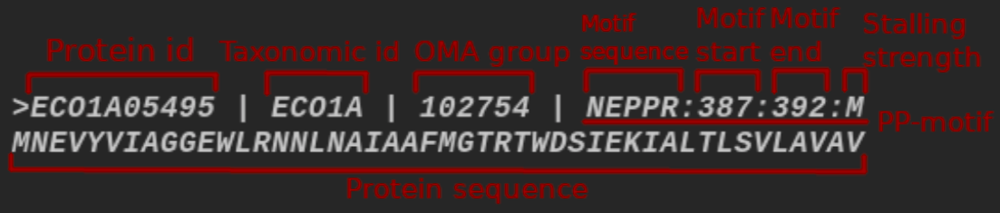
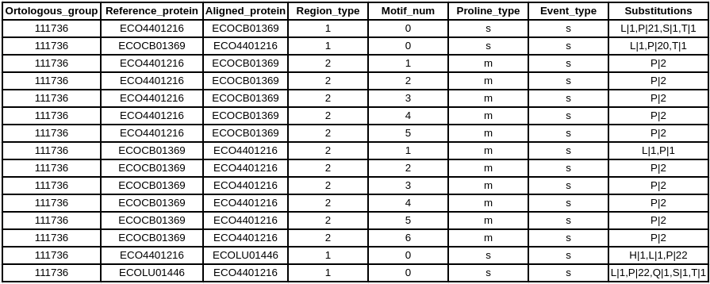

# Analysis of evolutionary conservation of polyproline motifs

## Purpose and objectives of the project

### Purpose:

Explore evolution of polyproline (PP-) motifs and their possible role in the formation of secondary and tertiary protein structures.

### Objectives:

1. **Analysis of polyproline motifs evolution**

   a. Download available proteomes of different strains of *Escherichia coli.*

   b. Divide proteins onto orthologous groups.

   c. Align proteins within orthologous groups pairwisely.

   d. Collect the statistics about the mutations.

   e. Analyze the conservation of polyproline motifs and single prolines.

2. **Overview of polyproline motifs enrichment in different types of protein secondary structures.**

   a. Download annotated reference proteome of *Escherichia coli* (K-12 substr. MG1655).

   b. Obtain the information about secondary structures for the proteins with resolved 3D structures.

   c. Analyze the enrichment of PP-motifs in different types of protein secondary structures.

### Future development

Scripts and analysis techniques, which were designed in the course of the project, might be applied to similar data of other types of organisms, e.g. eukaryotes and viruses.

## Data descriptions

Most of the data is not present in this repository due to large size. However, it can be downloaded with links below. Also there is toy dataset (**data/toy_dataset.tar.gz**), which allows you to test whole analysis pipeline on small data. All compressed files should be uncompressed before usage.

### Proteomes of *Escherichia coli* strains

*Escherichia coli* proteomes were obtained using the [OMA orthology database](https://omabrowser.org/oma/home/). All available *E.coli* strains (43) were downloaded using *Export All/All* tool by selecting strains of interest on the taxonomic tree. The full list of proteomes, which were used in this project, is specified in **proteome_list.txt** file.

Additional information is also needed for the extraction of OMA groups from proteomes. It is stored in **oma-groups.txt** file, which can be downloaded from [here](https://omabrowser.org/All/oma-groups.txt.gz). It contains lists of protein identifiers comprised in each OMA group. This file should be uncompressed before usage.

```bash
gunzip oma-groups.txt.gz
```

### Reference proteome of *Escherichia coli*

Annotated reference proteome *Escherichia coli* (K-12 substr. MG1655) was downloaded from [Uniprot database](https://www.uniprot.org/proteomes/UP000000625). 

## Workflow overview

### Dividing proteins into orthologous groups

This step is performed using **extract_og.py** script.

Input data is a list of fasta files containing proteomes of interest. Example dataset can be found in **data/toy_dataset.tar.gz**. 

The script divides proteins that are included in orthologous groups into different files representing these groups. In this project OMA groups with at least 1 protein having polyproline motif were selected. However **extract_og.py** allows other options.

The script also annotates polyproline motifs in the sequences, this includes start position, end position, motif stalling strength and motif sequence.



If there are more than one polyproline motifs, their entities are space-separated.

### Describing substitutions of proline

On this step **describe_substitutions.py** script is used.

Input data is a directory containing fasta files representing orthologous groups (output of **extract_og.py**).

At first it performs pairwise alignments for all proteins of each orthologous group. Then pairwise alignments are used for counting substitutions of proline. The detailed example of this process is provided in the [presentation](https://krglkvrmn.github.io/BI_2021_spring_project/Presentation.html) (6th slide).

Output is a directory containing TSV files with following structure:

 

**Orthologous_group** is an orthologous group ID.

**Reference_protein** is an ID of protein that was used as reference to count substitutions of proline.

**Aligned_protein** is an ID of protein that was used to detect and count substitution and insertion events.

**Region_type** is a class of region of interest:

1. Single prolines (P with no adjacent prolines) aligned with any other residue.
2. Motif prolines aligned with any other residues without insertions
3. Motif prolines aligned with prolines with insertions in between
4. Motif prolines with both insertions and substitutions.

**Motif_num** is an index number of polyproline motif in sequence (0 for single prolines).

**Proline_type**: "*m*" for "*Motif*" and "*s*" for "*Single*".

**Event_type**: "*s*" for "*Substitution*" and "*i*" for "*Insertion*".

**Substitutions** is an encoded numbers of proline substitutions to other amino acids in **aligned_protein** in comparison with **reference_protein**. For example, the second row in the table above tells us, that single prolines in *ECOCB01369* were substituted 1 time to *L*, 1 time to *T* and 20 times to *P* when comparing to *ECO4401216*. "*Prolines were substituted 20 time to P*" means that prolines were conserved.

### Analysis of proline conservation

Code of this step can be found in **Analysis_OMA.ipynb** notebook.

This step includes parsing of output obtained from previous step, detailed data description and statistical analysis of proline conservation.

### Analysis of polyproline motifs enrichment in different types of protein secondary structures

This step is described in **Structure_analysis.ipynb** notebook and requires *E.coli* reference proteome file.

At this step analysis of polyproline motif locations was performed. This included detection of overlapping with secondary structures and its position distribution in whole sequence and disordered regions.

## Usage

### Download source code and install dependencies

```
git clone https://github.com/krglkvrmn/BI_2021_spring_project
cd BI_2021_spring_project
pip install -r requirements.txt
```

Scripts were tested on **python 3.7.9** and **python 3.8.5**, notebooks were tested on **python 3.8.5** only. Correct work on other versions is not guaranteed.

### Hardware requirements

#### Testing setup:

**OS:** Pop!_OS 20.10

**CPU:** Intel® Core™ i3-7020U CPU @ 2.30GHz × 4

**RAM**: 12 GB

#### Memory usage (*Escherichia coli* dataset)

+ **extract_og.py**: less than **1** GB

+ **describe_substitutions.py**: less than **1** GB

+ **Analysis_OMA.ipynb**: less than **4** GB (consecutive cell execution)

+ **Structure_analysis.ipynb**: less than **1** GB (consecutive cell execution)

### Dividing proteins into orthologous groups (extract_og.py)

**oma-groups.txt** is required for this step.

```
extract_og.py [-h] [-i INPUT_FILES [INPUT_FILES ...]] [-o OUTPUT_DIR] [-g {HOG,OMA}] [--oma-groups OMA_GROUPS] [--full_HOG] [--incl-nonPP]

optional arguments:
  -h, --help            show this help message and exit
  -i INPUT_FILES [INPUT_FILES ...], --input_files INPUT_FILES [INPUT_FILES ...]
                        List of files with proteomes or other sets of proteins
  -o OUTPUT_DIR, --output_dir OUTPUT_DIR
                        Output directory
  -g {HOG,OMA}, --group {HOG,OMA}
                        Orthology group type
  --oma-groups OMA_GROUPS
                        Tab-separated file containing OMA groups and entry IDs of these groups
  --full_HOG            In case of using HOGs use full identifiers otherwise use higher taxonomic level parts of ID
  --incl-nonPP          Include groups without polyproline motifs in output
```

**Example:**

It is assumed that **ecoli_proteome_data** directory contains fasta files with individual proteomes of 43 *Escherichia coli* strains. 

```
python extract_og.py -i data/ecoli_proteome_data/* -o ecoli_OMAs_PP -g OMA --oma-groups oma-groups.txt
```

### Describing substitutions of proline (describe_substitutions.py)

This step can be parallelized. Output directory contains one file per thread named *"output_{thread_num}.tsv"*.

**Warning!** Execution might take too long (~1-1.5 days) for users with 2-4 CPU cores.

```
describe_substitutions.py [-h] -o OUTPUT [-t THREADS] [-s SUBSET] oma_groups_dir

positional arguments:
  oma_groups_dir        Path to directory containing fasta files which represent OMA groups

optional arguments:
  -h, --help            show this help message and exit
  -o OUTPUT, --output OUTPUT
                        Output directory
  -t THREADS, --threads THREADS
                        # of threads to use
  -s SUBSET, --subset SUBSET
                        Number of files to process (for testing)
```

**Example:**

```
python describe_substitutions.py --output output_dir --threads 4
```

### Analysis of proline conservation (Analysis_OMA.ipynb)

```
jupyter notebook Analysis_OMA.ipynb
# or
jupyter lab   # then select this notebook
```

### Analysis of polyproline motifs enrichment in different types of protein secondary structures (Structure_analysis.ipynb)

```
jupyter notebook Structure_analysis.ipynb
# or
jupyter lab   # then select this notebook
```

